---
## Front matter
lang: ru-RU
title: Лабораторная работа №1
subtitle: Работа с git
author:
  - Коннова Татьяна Алексеевна
institute:
  - Российский университет дружбы народов, Москва, Россия
date: 16 февраля 2025

## i18n babel
babel-lang: russian
babel-otherlangs: english

## Formatting pdf
toc: false
toc-title: Содержание
slide_level: 2
aspectratio: 169
section-titles: true
theme: metropolis
header-includes:
 - \metroset{progressbar=frametitle,sectionpage=progressbar,numbering=fraction}
 - '\makeatletter'
 - '\beamer@ignorenonframefalse'
 - '\makeatother'
---

# Информация

## Докладчик

:::::::::::::: {.columns align=center}
::: {.column width="70%"}

  * Коннова Татьяна Алексеевна
  * Студентка кафедры теории вероятностей и кибербезопасности
  * Российский университет дружбы народов
  * <https://github.com/KONNOVAT>

:::
::::::::::::::

# Вводная часть

## Цели и задачи

- Научиться полному взаимодействию с git и разобрать основные его особенности.

# Основная часть

## Создание проекта

{#fig:001 width=50%}

## Создание проекта

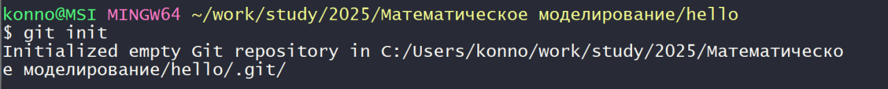{#fig:002 width=50%}

## Создание проекта

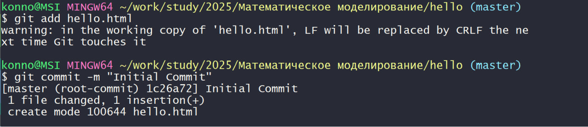{#fig:003 width=50%}

## Создание проекта

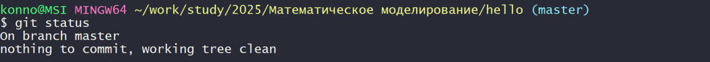{#fig:004 width=50%}

## Внесение изменений

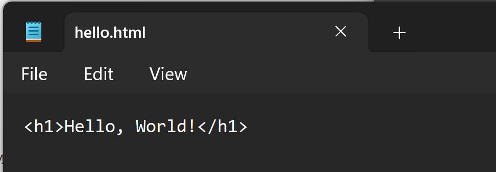{#fig:005 width=50%}

## Внесение изменений

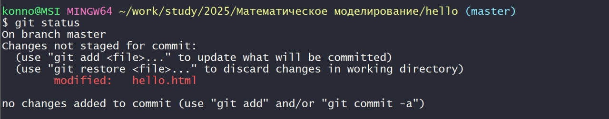{#fig:006 width=50%}

## Индексация изменений

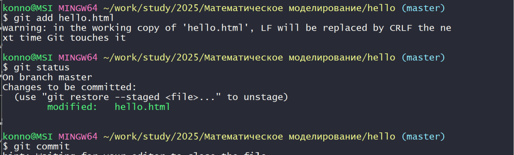{#fig:007 width=50%}

## Индексация изменений

{#fig:008 width=50%}

## Индексация изменений

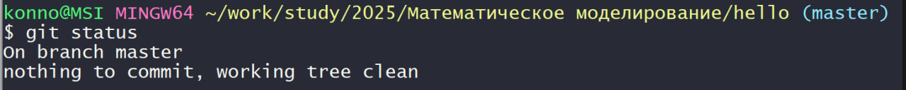{#fig:009 width=50%}

## Индексация изменений

{#fig:010 width=50%}

## Индексация изменений

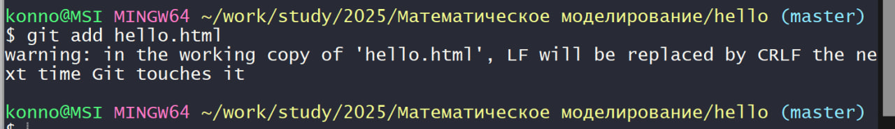{#fig:011 width=50%}

## Индексация изменений

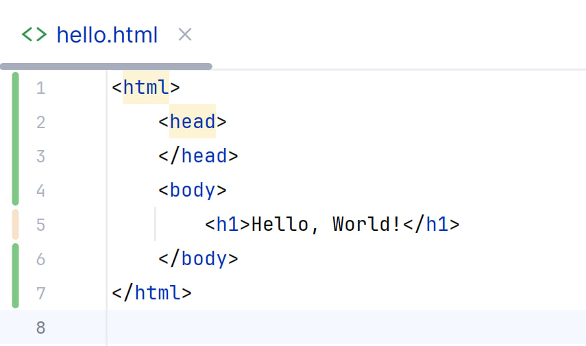{#fig:012 width=50%}

## Индексация изменений

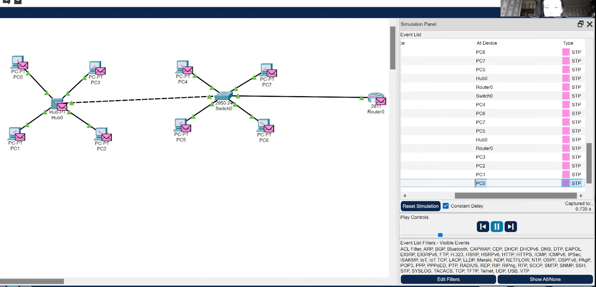{#fig:013 width=50%}

## Индексация изменений

{#fig:014 width=50%}

## Индексация изменений

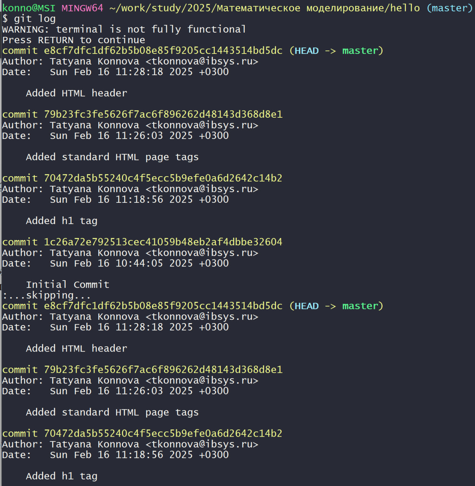{#fig:015 width=50%}

## Индексация изменений

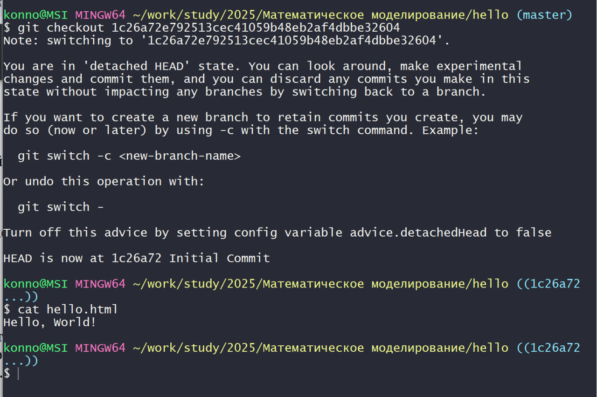{#fig:016 width=50%}

## Индексация изменений

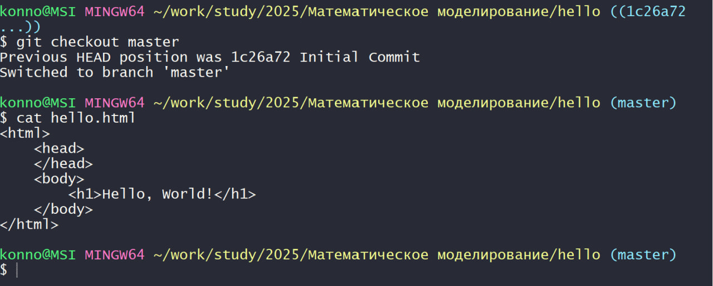{#fig:017 width=50%}

## Индексация изменений

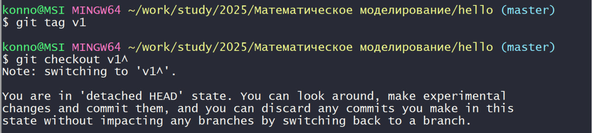{#fig:018 width=50%}

## Отмена локальных изменений (до индексации)

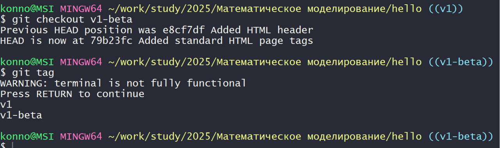{#fig:019 width=50%}

## Отмена локальных изменений (до индексации)

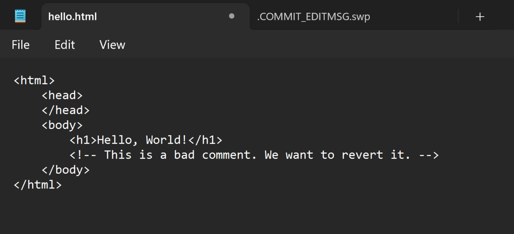{#fig:020 width=50%}

## Отмена локальных изменений (до индексации)

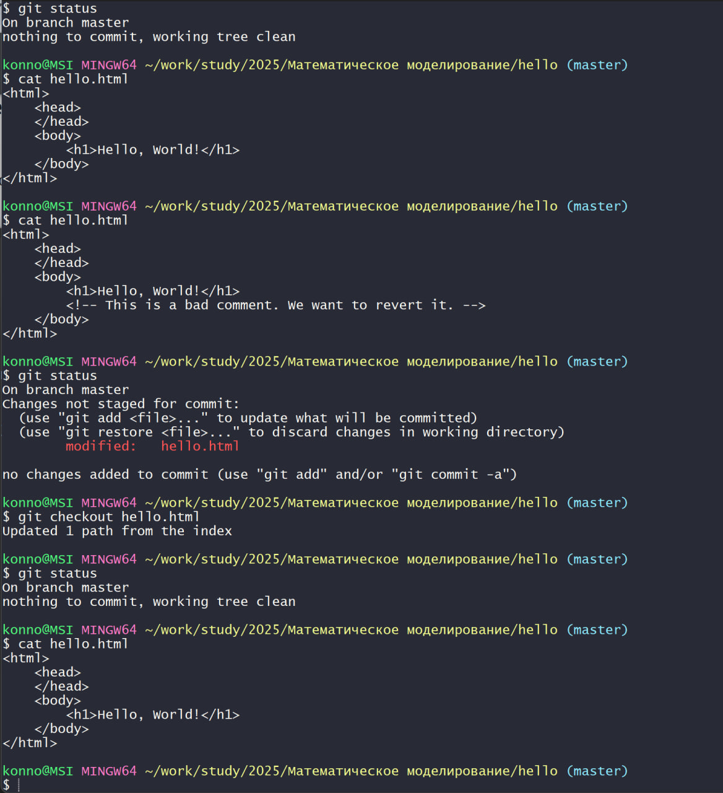{#fig:021 width=50%}

## Отмена локальных изменений (до индексации)

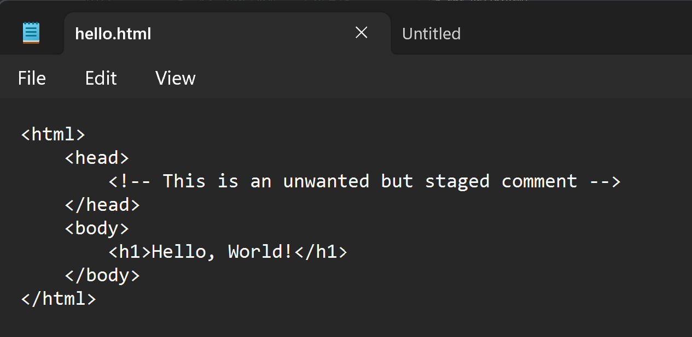{#fig:022 width=50%}

## Отмена проиндексированных изменений (перед коммитом)

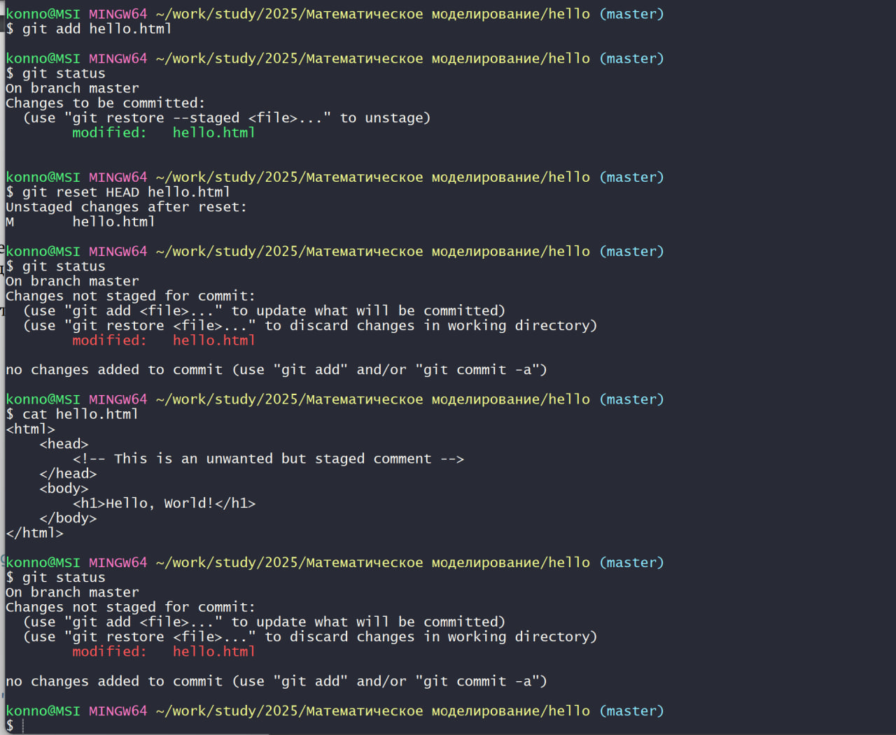{#fig:023 width=50%}

## Отмена локальных изменений (до индексации)

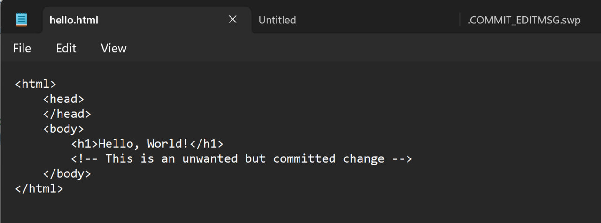{#fig:024 width=50%}

## Отмена проиндексированных изменений (перед коммитом)

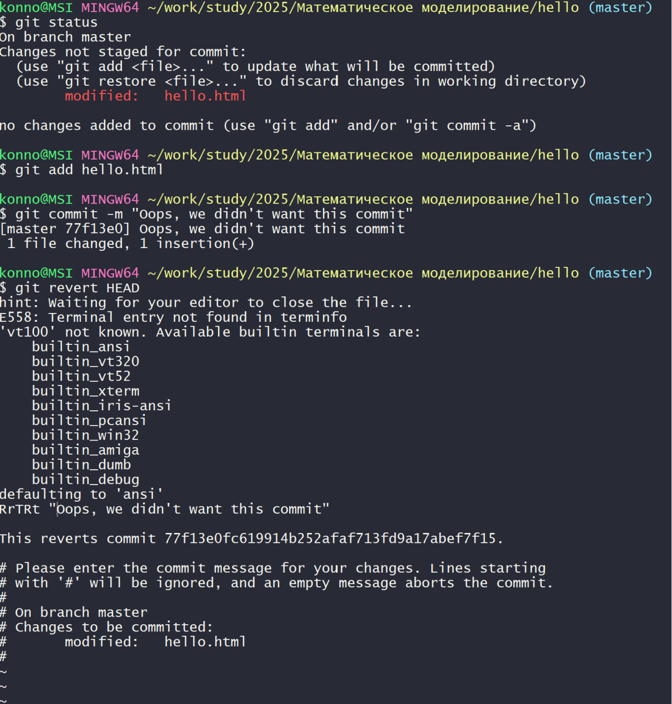{#fig:025 width=50%}

## Выводы

- В результате выполнения лабораторной работы мы научились полному взаимодействию с git 
и разобрали основные его особенности.
