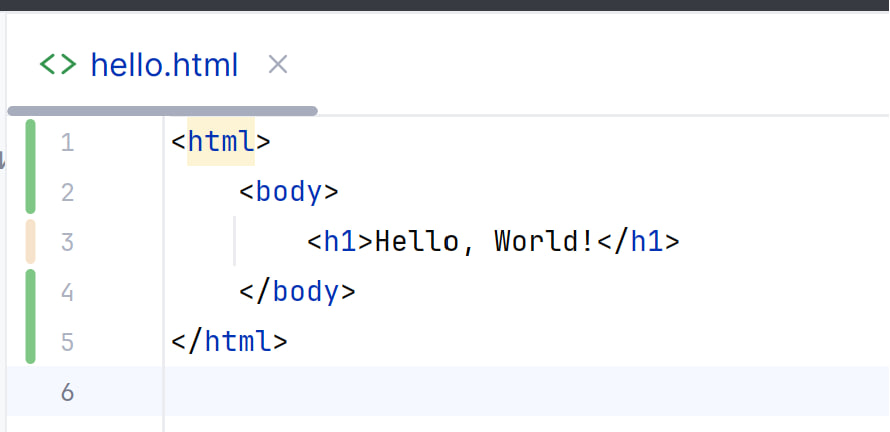

---
## Front matter
title: "Лабораторная работа №1"
subtitle: "Работа с git"
author: "Коннова Татьяна Алексеевна"

## Generic otions
lang: ru-RU
toc-title: "Содержание"

## Bibliography
bibliography: bib/cite.bib
csl: pandoc/csl/gost-r-7-0-5-2008-numeric.csl

## Pdf output format
toc: true # Table of contents
toc-depth: 2
lof: true # List of figures
lot: true # List of tables
fontsize: 12pt
linestretch: 1.5
papersize: a4
documentclass: scrreprt
## I18n polyglossia
polyglossia-lang:
  name: russian
  options:
	- spelling=modern
	- babelshorthands=true
polyglossia-otherlangs:
  name: english
## I18n babel
babel-lang: russian
babel-otherlangs: english
## Fonts
mainfont: PT Serif
romanfont: PT Serif
sansfont: PT Sans
monofont: PT Mono
mainfontoptions: Ligatures=TeX
romanfontoptions: Ligatures=TeX
sansfontoptions: Ligatures=TeX,Scale=MatchLowercase
monofontoptions: Scale=MatchLowercase,Scale=0.9
## Biblatex
biblatex: true
biblio-style: "gost-numeric"
biblatexoptions:
  - parentracker=true
  - backend=biber
  - hyperref=auto
  - language=auto
  - autolang=other*
  - citestyle=gost-numeric
## Pandoc-crossref LaTeX customization
figureTitle: "Рис."
tableTitle: "Таблица"
listingTitle: "Листинг"
lofTitle: "Список иллюстраций"
lotTitle: "Список таблиц"
lolTitle: "Листинги"
## Misc options
indent: true
header-includes:
  - \usepackage{indentfirst}
  - \usepackage{float} # keep figures where there are in the text
  - \floatplacement{figure}{H} # keep figures where there are in the text
---

# Цель работы

Научиться полному взаимодействию с git и разобрать основные его особенности.

# Выполнение лабораторной работы

Начнём работу в пустом рабочем каталоге с создания пустого каталога с именем
hello, затем войдём в него и создадим там файл с именем hello.html (рис. [-@fig:001]).

{#fig:001 width=100%}

Чтобы создать git репозиторий из этого каталога, выполним команду git init (рис. [-@fig:002]).

{#fig:002 width=100%}

Добавим файл в репозиторий (рис. [-@fig:003]).

{#fig:003 width=100%}

Используем команду git status, чтобы проверить текущее состояние репозитория (рис. [-@fig:004]).

{#fig:004 width=100%}

Добавим кое-какие HTML-теги к нашему приветствию. Изменим содержимое
файла hello.html (рис. [-@fig:005]).

{#fig:005 width=100%}

Проверим состояние рабочего каталога (рис. [-@fig:006]).

{#fig:006 width=100%}

Теперь выполним команду git, чтобы проиндексировать изменения. Проверим
состояние (рис. [-@fig:007]).

{#fig:007 width=100%}

Сделаем коммит и проверим состояние. Откроется редактор.
В первой строке введём комментарий: «Added h1 tag». Сохраним файл и выйдем из редактора (рис. [-@fig:008]).

{#fig:008 width=100%}

Теперь еще раз проверим состояние (рис. [-@fig:009]).

{#fig:009 width=100%}

Изменим страницу «Hello, World», чтобы она содержала стандартные теги <html>
и <body> (рис. [-@fig:010]).

{#fig:010 width=100%}

Теперь добавим это изменение в индекс git (рис. [-@fig:011]).

{#fig:011 width=100%}

Теперь добавим заголовки HTML (секцию <head>) к странице «Hello, World» (рис. [-@fig:012]).

{#fig:012 width=100%}

Проверим текущий статус. Произведём коммит проиндексированного изменения (значение по умолчанию), а затем еще раз проверим состояние.
Далее добавим второе изменение в индекс, а затем проверим состояние с помощью команды git status и сделаем коммит второго изменения (рис. [-@fig:013]).

{#fig:013 width=100%}

Получим список произведенных изменений различными способами (рис. [-@fig:014]).

{#fig:014 width=100%}

Получим хэши предыдущих версий. Затем проверим содержимое файла hello.html и вернёмся к последней версии в ветке master (рис. [-@fig:015]).

{#fig:015 width=100%}

Создадим тег первой версии. Далее переключимся на предыдущую версию. Это версия c тегами <html> и <body>, но еще пока без <head>. Давайте сделаем
ее версией v1-beta (рис. [-@fig:016]).

{#fig:016 width=100%}

Теперь попробуем попереключаться между двумя отмеченными версиями (рис. [-@fig:017]).

{#fig:017 width=100%}

Мы можем увидеть, какие теги доступны, используя команду git tag и также можем посмотреть теги в логе (рис. [-@fig:018]).

{#fig:018 width=100%}

Убедимся, что мы находимся на последнем коммите ветки master, прежде чем продолжить работу (рис. [-@fig:019]).

{#fig:019 width=100%}

Внесём изменение в файл hello.html в виде нежелательного комментария (рис. [-@fig:020]).

{#fig:020 width=100%}

Сначала проверим состояние рабочего каталога (рис. [-@fig:023]).

{#fig:021 width=100%}

Используем команду git checkout для переключения версии файла hello.html в репозитории (рис. [-@fig:022]).

{#fig:022 width=100%}

Внесём изменение в файл hello.html в виде нежелательного комментария (рис. [-@fig:023]).

{#fig:023 width=100%}

Проиндексируем это изменение (рис. [-@fig:024]).

{#fig:024 width=100%}

Проверим состояние нежелательного изменения (рис. [-@fig:025]).

{#fig:025 width=100%}

# Выводы

В результате выполнения лабораторной работы мы научились полному взаимодействию с git 
и разобрали основные его особенности.